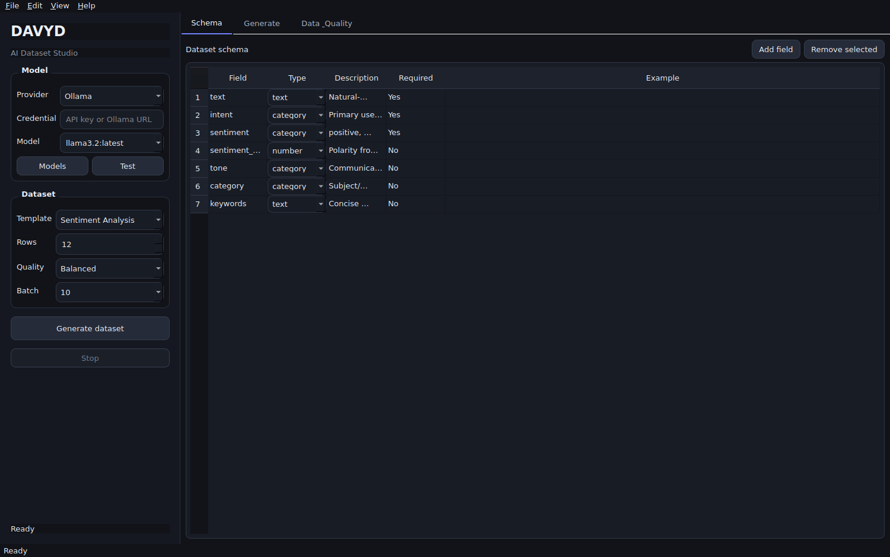
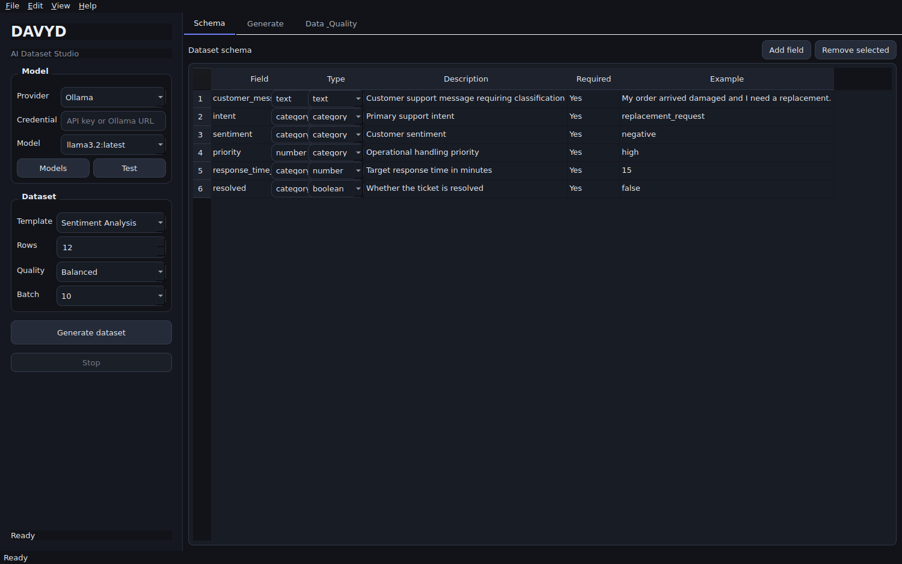
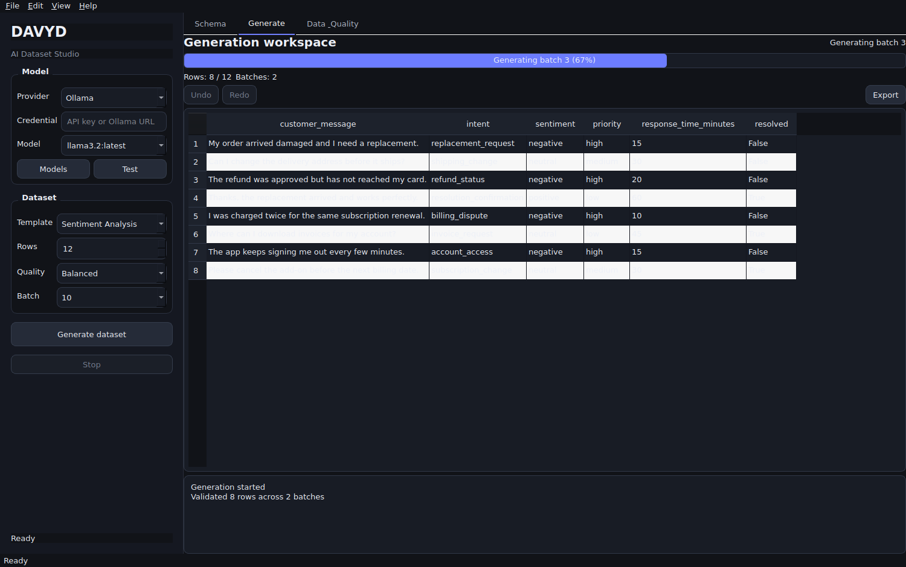
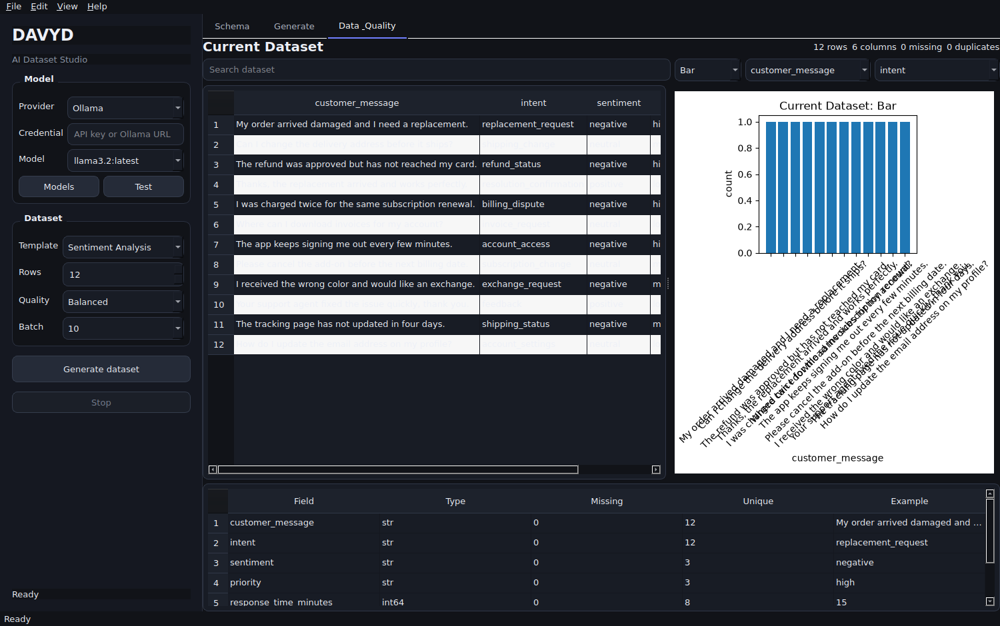

# DAVYD Dataset Studio · Visual Walkthrough

These captures are rendered from the current PySide6 desktop application. They document the supported consumer workflow rather than a separate design mockup.

The populated screenshots use a deterministic support-dataset documentation fixture to exercise DAVYD's real schema, streaming table, progress, profiling, search, and chart UI without embedding provider credentials or claiming that a hosted model produced the pictured rows.

## Application overview



DAVYD opens as one desktop workspace with persistent generation controls on the left and three canonical workspaces on the right: **Schema**, **Generate**, and **Data & Quality**. Provider/model selection, dataset size, quality, and batch controls remain available without triggering network calls simply because the application opened.

## 1. Define the schema



The **Schema** workspace is the definition authority for generated records. Each field carries a name, type, description, required flag, and example. Schema changes are propagated to the Generate and Data & Quality workspaces through the existing desktop signal flow.

The screenshot shows a customer-support schema with text, categorical, numeric, and boolean fields. This is documentation data only; the schema editor shown is the real application UI.

## 2. Watch generation stream into the workspace



The **Generate** workspace is shown mid-run at 67% with validated rows already streamed into the editable table. The live UI exposes:

- generation state and progress;
- current row and batch counts;
- the generated table as batches arrive;
- undo and redo controls for post-generation editing;
- export access;
- a compact generation log.

For this capture, the documentation fixture is sent through `GenerationTab`'s real batch queue, flush, progress, and table-rendering methods. A normal user run reaches the same UI through `DatasetGenerationWorker` and the configured model provider.

## 3. Inspect data quality and distributions



The **Data & Quality** workspace receives the canonical dataset and combines a searchable preview with native Matplotlib visualization and column profiling. The header summarizes row count, column count, missing values, and duplicates, while the lower quality table reports field type, missing count, unique count, and an example value.

The chart controls support histogram, bar, and scatter views. The capture uses a bar view of the support-dataset priority field.

## Supported user flow

```text
Schema
  ↓
Generate with a configured provider/model
  ↓
Stream validated batches + progress
  ↓
Edit / undo / redo
  ↓
Data & Quality inspection
  ↓
Export CSV / JSON / Parquet / Excel
```

`MainWindow` remains the single generation orchestrator. Provider work runs through the Qt worker path, generated edits remain canonical, and Data & Quality refreshes from that current dataset when opened.

## Screenshot provenance

The PNGs in `docs/images/` were captured from the real application at 1500 × 940 using Qt's own window capture after constructing `MainWindow`, `MenuBar`, and the production theme. The capture run also verified that every PNG was non-empty before committing it to the repository.
